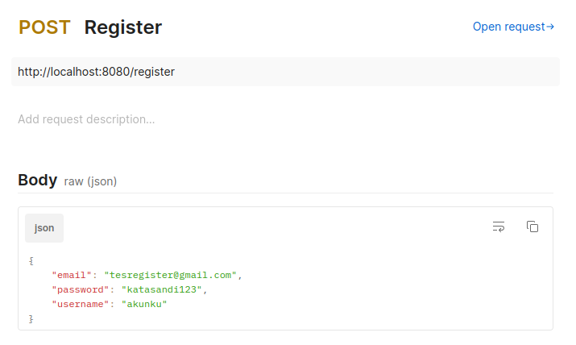
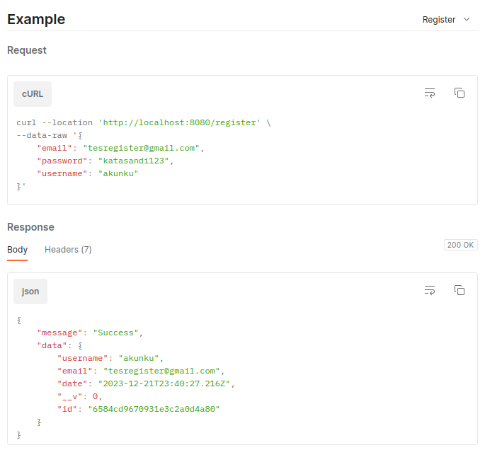
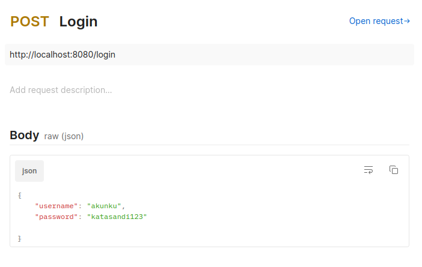
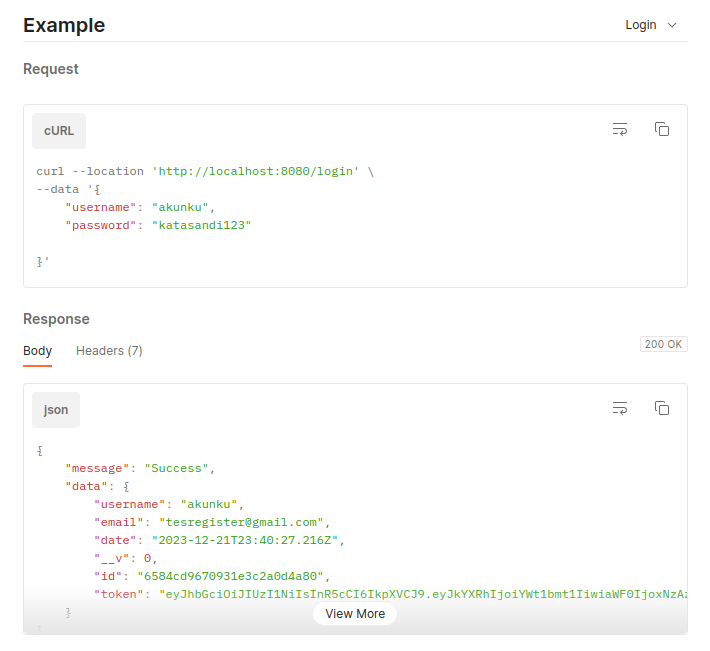

# Authentication API

## Requirements
- MongoDB 
- NodeJS
- npm / yarn / pnpm

## How to run
1. Create a new database with MongoDB 
2. Change the value of MONGO_URI on .env file based on the created database (default database name is 'auth-alphakids')
3. Install all required modules/libraries with npm/yarn/pnpm (`npm install`)
4. Run the local API server (`npm run dev`)

Access API through http://127.0.0.1:8080

## Usage Documentation
### Register Endpoint

URL and request body:

Example with response:

### Login Endpoint

URL and request body:

Example with response:

